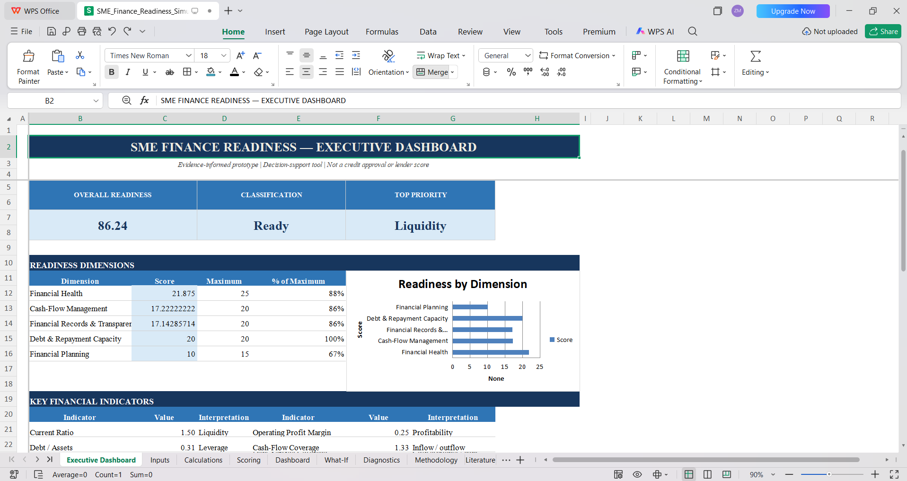

# SME Finance Readiness & Improvement Simulator

## Overview

The **SME Finance Readiness & Improvement Simulator** is an evidence-informed financial decision-support prototype designed to assess how prepared a small or medium-sized enterprise is to manage and present its finances for potential external financing.

Rather than treating finance readiness as a single financial ratio, the simulator combines:

- Financial health
- Cash-flow management
- Financial records and transparency
- Debt and repayment capacity
- Financial planning

It produces a transparent **100-point prototype readiness score**, diagnostic indicators, management recommendations, and a **What-If improvement simulator**.

> **Important:** This is an academic/portfolio prototype. It is not a lender credit score, financing approval system, investment recommendation, or regulatory tool.

## Project Preview



---

## Why this project?

SMEs can face financing constraints not only because of financial performance, but also because of information quality, recordkeeping, cash-flow management, planning, and the ability to demonstrate repayment capacity.

This project translates those dimensions into a transparent, explainable prototype that a small business owner can interact with.

---

## Core Architecture

```text
SME Inputs
    ↓
Financial & Management Indicators
    ↓
100-Point Readiness Model
    ↓
Diagnostics
    ↓
Prioritized Recommendations
    ↓
What-If Improvement Simulation
```

### Five dimensions

| Dimension | Weight |
|---|---:|
| Financial Health | 25% |
| Cash-Flow Management | 20% |
| Financial Records & Transparency | 20% |
| Debt & Repayment Capacity | 20% |
| Financial Planning | 15% |
| **Total** | **100%** |

The weights and normalization thresholds are transparent **prototype design choices** and are not presented as universal lending standards.

---

## Indicators

The model uses:

- Current ratio
- Operating profit margin
- Debt-to-assets ratio
- Cash-flow coverage
- Cash reserve in months
- Cash-flow debt-service coverage proxy
- Recordkeeping practices
- Financial planning practices

The debt-service measure is deliberately labeled a **proxy** rather than formal DSCR because the prototype is designed for educational and decision-support purposes rather than lender underwriting.

---

## What the simulator produces

### 1. Readiness score

A 0–100 composite score summarizing the five dimensions.

### 2. Classification

- **Ready**
- **Developing**
- **Needs Improvement**

These bands are prototype interpretation bands rather than externally validated credit categories.

### 3. Diagnostics

The workbook identifies weaknesses across liquidity, profitability, leverage, cash flow, records, debt capacity and planning.

### 4. Recommendations

Each identified weakness is translated into an actionable management recommendation with a priority level.

### 5. What-If simulation

Users can change hypothetical variables such as:

- Revenue
- Operating expenses
- Total assets
- Current assets
- Current liabilities
- Total debt
- Monthly inflows
- Monthly outflows
- Monthly debt payments
- Cash reserves
- Financial management practices

The simulator then shows the indicative change in readiness.

---

## Quality Control

The final version includes a dedicated **QC & Validation** sheet.

Testing covered:

- Baseline reproduction
- Strong-improvement scenario
- Weak/stress scenario
- Zero-denominator edge cases
- Liquidity scenario logic
- Leverage scenario logic
- Debt-service proxy consistency
- Dashboard/recommendation links
- Score bounds

The model is designed so that invalid or zero-denominator cases do not generate division errors.

---

## Evidence Base

The methodology was informed by literature and institutional work concerning SME finance, financial information, credit reporting, information asymmetry and financing constraints, including OECD and World Bank materials.

The evidence is used to motivate the *dimensions* of the framework. It does **not** imply that the exact weights or thresholds have been empirically validated.

---

## Limitations

This prototype should not be interpreted as a validated credit-scoring model.

Key limitations include:

1. The weights are researcher-designed prototype choices.
2. Thresholds require empirical calibration.
3. The debt-service measure is a simplified cash-flow proxy.
4. Management-practice responses are self-reported.
5. No lender-specific underwriting rules are included.
6. External validation using real SME outcomes has not yet been performed.

---

## Future Development

A future research version could:

- Collect a larger SME dataset.
- Test reliability of management-practice measures.
- Use exploratory and confirmatory factor analysis.
- Estimate statistically validated weights.
- Test predictive validity against financing outcomes.
- Compare results across SME sectors and firm sizes.
- Develop a web-based interface.
- Add sensitivity and uncertainty analysis.

---

## Repository Structure

```text
SME-Finance-Readiness-Simulator/
│
├── README.md
├── model/
│   └── SME_Finance_Readiness_Simulator.xlsx
│
├── data/
│   └── README.md
│
├── documentation/
│   ├── Project_Report.docx
│   └── CV_and_Scholarship_Wording.docx
│
├── case-study/
│   └── Case_Study.docx
│
└── screenshots/
```

---

## Academic Positioning

This project demonstrates applied skills in:

- Corporate finance
- SME finance
- Financial ratio analysis
- Financial modelling
- Decision-support system design
- Spreadsheet engineering
- Scenario analysis
- Research methodology
- Evidence-based model development

It is intended as a **research-oriented portfolio project**, with a clear pathway from conceptual framework → prototype → testing → empirical validation.

---

## Author

**Zunaira Fatima**  
BBA — Finance

